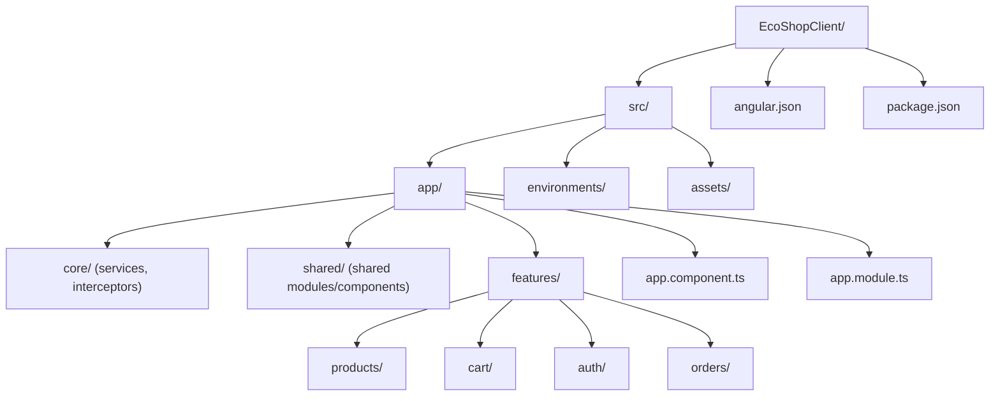

# EcoShopClient

> Frontend Angular SPA for [EcoShopApi](https://github.com/MostafaElmarakpy/EcoShopApi)

---

## 📝 Project Overview

**EcoShopClient** is a modern Angular single-page application that serves as the web frontend for the EcoShop e-commerce platform. It is designed to provide a fast, responsive, and user-friendly shopping experience, fully integrated with the EcoShop ASP.NET API backend.

### 🎯 Purpose and Goals

- Deliver a robust, maintainable, and scalable e-commerce UI
- Provide a seamless interface for browsing, searching, and purchasing products
- Integrate securely with the backend API for all business logic and data
- Serve as a best-practice Angular reference for enterprise-grade e-commerce SPAs

### 👤 Target Audience

- Shoppers and customers seeking a modern online store experience
- Business owners launching or demoing e-commerce solutions
- Developers interested in a full-stack Angular + .NET reference implementation

---

## ✨ Key Features

- Product catalog with categories and filtering
- Product details, images, and pricing
- User authentication (register/login via JWT)
- Shopping cart with quantity management
- Order checkout and status tracking
- User profile management
- Admin features (if supported by backend)
- Responsive design (Bootstrap)
- Integration with EcoShopApi backend via REST
- Error handling and loading indicators
- Unit and end-to-end testing

---

## 🛠️ Technical Specifications

- **Framework:** Angular CLI `v19.1.7`
- **Core:** Angular v19+
- **State Management:** RxJS, Observables, possibly NgRx (check `package.json`)
- **Styling:** Bootstrap 5, SCSS
- **HTTP:** Angular HttpClient (RESTful integration)
- **Testing:** Karma/Jasmine (unit), Cypress or Playwright (E2E)
- **API Integration:** Connects to [EcoShopApi](https://github.com/MostafaElmarakpy/EcoShopApi) at configurable base URL

### Main Dependencies (see `package.json` for full list)

- `@angular/core`: ^19.x
- `@angular/router`: ^19.x
- `@angular/forms`: ^19.x
- `bootstrap`: ^5.x
- `rxjs`: ^7.x
- `@auth0/angular-jwt`: ^6.x
- `@angular/material`: (if used)
- `ngx-toastr`, `ng-bootstrap`: (if used)

---

## 🔗 API Integration

- All product, category, cart, auth, and order features are powered by EcoShopApi.
- API base URL is set in `src/environments/environment.ts`:
  ```typescript
  export const environment = {
    apiUrl: 'http://localhost:5039/api'
  };
  ```
- Auth uses JWT: tokens are stored and attached to requests via interceptors.
- All endpoints mirror backend routes (see [EcoShopApi docs](https://github.com/MostafaElmarakpy/EcoShopApi#api-endpoints)).

---

## 🏗️ Project & Component Structure

```plaintext
EcoShopClient/
├── src/
│   ├── app/
│   │   ├── core/         # Services (auth, products, API, interceptors)
│   │   ├── shared/       # Shared modules, pipes, components
│   │   ├── features/
│   │   │   ├── products/      # Product listing, details
│   │   │   ├── cart/          # Shopping cart
│   │   │   ├── auth/          # Login/register
│   │   │   ├── orders/        # Order placement
│   │   │   └── ...            # Other features
│   │   ├── app.component.ts
│   │   └── app.module.ts
│   ├── assets/
│   └── environments/
│       ├── environment.ts
│       └── environment.prod.ts
├── angular.json
├── package.json
└── ...
```

---

## 🗂️ Solution Structure (Visual)




## 🚀 Setup & Development

### 1. Clone the Repository

```bash
git clone https://github.com/MostafaElmarakpy/EcoShopClient.git
cd EcoShopClient
```

### 2. Install Dependencies

```bash
npm install
```

### 3. Environment Configuration

- Set the API base URL in `src/environments/environment.ts`
- For production, adjust `environment.prod.ts`

### 4. Run Development Server

```bash
ng serve --open
```
- App runs at `http://localhost:4200`

### 5. Build for Production

```bash
ng build --configuration production
```

### 6. Testing

- **Unit tests:**  
  ```bash
  ng test
  ```
  (Karma/Jasmine)

- **End-to-end (E2E) tests:**  
  If using Cypress:  
  ```bash
  npx cypress open
  ```
  If using Playwright:  
  ```bash
  npx playwright test
  ```

---

## 📖 Documentation

- **API Endpoints:**  
  All endpoints are documented in [EcoShopApi README](https://github.com/MostafaElmarakpy/EcoShopApi#api-endpoints).  
  Integration is handled via Angular services in `src/app/core/`.

- **Component Structure:**  
  Each feature (products, cart, auth, etc.) is in its own folder under `src/app/features/`.

- **Demo Screenshots/Videos:**  
  (Add screenshots of home, product, cart, order pages here)

---

## 🤝 Contribution Guidelines

- Fork the repo and make a feature branch (`feature/your-feature`)
- Follow Angular style guide for code and folder structure
- Include tests for new features
- Open a pull request with clear description

---

## ⚖️ License

This project is licensed under the MIT License.  
See [LICENSE](LICENSE) for details.

---

## 📣 Additional Notes

- **Backend:** [EcoShopApi](https://github.com/MostafaElmarakpy/EcoShopApi)
- **Frontend:** [EcoShopClient](https://github.com/MostafaElmarakpy/EcoShopClient)
- **Future:** E-payment integration, inventory management, product rating system  
- **Architecture:** Clean, maintainable, scalable, testable

---
