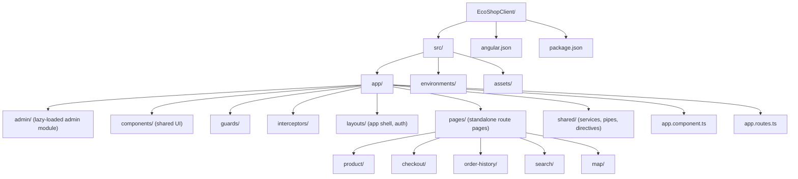

# EcoShopClient

> Modern Angular storefront for the EcoShop API backend.

---

## 🆕 What's New

- Added lazy-loaded routes for `/products`, `/product/:id`, `/search`, `/checkout`, `/orders`, and `/map`
- Implemented standalone route components for Products, Search, Checkout, Orders, and Map
- Introduced Angular Signals-based state management for reactive UI updates
- Added debounced search in the header for faster, user-friendly search
- Added a class-based theme service with light/dark mode support
- Added detailed product pages with clean product detail UX
- Added a multi-step checkout skeleton for order completion
- Added order history tracking and listing
- Added geolocation-backed map view for nearby locations
- Added shared services: `ThemeService`, `CartService`, `OrderService`
- Updated `ProductService` to support pagination, filtering, sorting, and search

---

## 📝 Project Overview

**EcoShopClient** is a refactored Angular storefront built for the EcoShop e-commerce backend. It focuses on modern Angular architecture, performance, and feature-rich customer workflows.

### 🎯 Purpose and Goals

- Deliver a maintainable, scalable and enterprise-ready Angular frontend
- Provide fast browsing, search, checkout, and order history flows
- Improve SEO readiness with route-level lazy loading and standalone components
- Support responsive, accessible user experiences with theme switching
- Keep integration patterns clean and service-driven for backend API access

### 👤 Target Audience

- Customers shopping eco-conscious products online
- Product teams evaluating Angular-based e-commerce UI
- Developers building modern frontends with Angular 19+ and Signals

---

## ✨ Key Features

- Standalone, lazy-loaded routes for optimized startup performance
- Product catalog with pagination, filtering, sorting, and search
- Product detail page for richer product information
- Debounced search experience from the header
- Multi-step checkout flow with cart and order summary
- Order history page for past purchases and tracking
- Geolocation-enabled Map view for location-aware UI
- Dark mode support via `ThemeService` and body class toggling
- Shared state via reactive services: `ThemeService`, `CartService`, `OrderService`
- Admin functionality behind a lazy-loaded admin module
- Responsive UI using Bootstrap 5 and PrimeNG support
- JWT-based authentication and route guarding for protected pages

---

## 🆕 Latest Updates (Refactor Summary)

The latest refactor moves EcoShopClient from a traditional Angular SPA toward a modern standalone-component architecture. Key updates include:

- Route-level lazy loading for major page entry points
- Standalone components for pages and many shared UI elements
- Signals-based reactive state management for cart and theme state
- A consolidated shared services layer for product, cart, order and theme logic
- A cleaner app shell using auth and user layouts
- Better SEO-friendly route metadata and `loadComponent` usage
- A stronger foundation for future Angular Universal / SSR support

---

## 🛠️ Technical Specifications

- **Angular Version:** 19.x
- **App Architecture:** Standalone components, route-level lazy loading, service-driven state
- **State Management:** Angular Signals + RxJS patterns
- **Routing:** `loadComponent` lazy-loaded routes in `src/app/app.routes.ts`
- **Styling:** Bootstrap 5, PrimeNG, PrimeFlex
- **HTTP Layer:** Angular `HttpClient` with API service wrappers
- **Auth:** JWT token support and `authGuard`-protected pages
- **Build Tools:** Angular CLI, TypeScript 5.7
- **Testing:** Karma + Jasmine

### Core Dependencies

- `@angular/core`, `@angular/router`, `@angular/forms` (Angular 19)
- `bootstrap` 5.3
- `@ng-bootstrap/ng-bootstrap`
- `primeng` and `primeflex`
- `rxjs` 7.x

---

## 🔗 API Integration

- Connects to the EcoShop API backend via REST through Angular services.
- API base URL is configured in `src/environments/environment.ts`.
- Authentication uses JWT tokens attached via HTTP interceptors.
- Product, cart, order, and theme features are powered by shared Angular services.

Example environment entry:

```typescript
export const environment = {
  apiUrl: 'http://localhost:5039/api'
};
```

---

## 🏗️ Project Structure

```plaintext
EcoShopClient/
├── src/
│   ├── app/
│   │   ├── admin/                  # lazy-loaded admin module
│   │   ├── components/             # shared UI components
│   │   ├── guards/                 # route guards
│   │   ├── interceptors/           # HTTP interceptors
│   │   ├── layouts/                # app shell and auth layouts
│   │   ├── pages/                  # standalone route pages
│   │   │   ├── checkout/
│   │   │   ├── order-history/
│   │   │   ├── product/
│   │   │   ├── search/
│   │   │   ├── map/
│   │   ├── shared/
│   │   │   ├── directives/
│   │   │   ├── services/           # ThemeService, CartService, OrderService, ProductService
│   │   │   ├── pipes/
│   │   ├── app.routes.ts
│   │   ├── app.component.ts
│   │   └── app.config.ts
│   ├── assets/
│   └── environments/
├── angular.json
├── package.json
└── README.md
```

---

## 🗂️ Solution Structure (Visual)


```mermaid
flowchart TD
    Root["EcoShopClient/"]
    Root --> SRC["src/"]
    SRC --> APP["app/"]
    APP --> ADMIN["admin/ (lazy-loaded admin module)"]
    APP --> COMPONENTS["components/ (shared UI)"]
    APP --> GUARDS["guards/"]
    APP --> INTERCEPTORS["interceptors/"]
    APP --> LAYOUTS["layouts/ (app shell, auth)"]
    APP --> PAGES["pages/ (standalone route pages)"]
    PAGES --> PRODUCT["product/"]
    PAGES --> CHECKOUT["checkout/"]
    PAGES --> ORDERS["order-history/"]
    PAGES --> SEARCH["search/"]
    PAGES --> MAP["map/"]
    APP --> SHARED["shared/ (services, pipes, directives)"]
    APP --> APPCOMP["app.component.ts"]
    APP --> APPRTS["app.routes.ts"]
    SRC --> ENV["environments/"]
    SRC --> ASSETS["assets/"]
    Root --> ANGJSON["angular.json"]
    Root --> PKG["package.json"]
```

---

## 🚀 Setup & Development

### 1. Clone the Repository

```bash
git clone https://github.com/MostafaElmarakpy/EcoShopClient.git
cd EcoShopClient
```

### 2. Install Dependencies

```bash
npm install
```

### 3. Configure the API

- Update `src/environments/environment.ts`
- Update `src/environments/environment.prod.ts` for production

### 4. Run the App

```bash
ng serve --open
```

### 5. Build for Production

```bash
ng build --configuration production
```

### 6. Run Tests

- Unit tests:
  ```bash
  ng test
  ```
- E2E tests (if configured):
  ```bash
  npx cypress open
  ```
  or
  ```bash
  npx playwright test
  ```

---

## 📖 Documentation

- **API Reference:** See [EcoShopApi README](https://github.com/MostafaElmarakpy/EcoShopApi#api-endpoints)
- **Route Configuration:** `src/app/app.routes.ts`
- **Shared Services:** `src/app/shared/services/`
- **Modern Angular Concepts:** standalone routes, Signals-based state, lazy loading, class-based dark mode

---

## 🤝 Contribution Guidelines

- Fork the repo and use a feature branch
- Follow Angular style guide and consistent folder organization
- Prefer standalone components and service-based state
- Add tests for new features or fixes
- Document major changes clearly in PR descriptions

---

## ⚖️ License

This project is licensed under the MIT License.  
See [LICENSE](LICENSE) for details.

---

## 📣 Additional Notes

- **Backend:** [EcoShopApi](https://github.com/MostafaElmarakpy/EcoShopApi)
- **Frontend:** [EcoShopClient](https://github.com/MostafaElmarakpy/EcoShopClient)
- **Future Opportunities:** SSR/Angular Universal, payments, ratings, inventory management
- **Architecture:** Modern Angular 19 application with standalone lazy pages, service-driven integration, and signal-backed state
